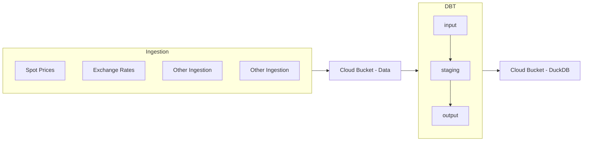

# AquaDuck


## Overview

**AquaDuck** is a streamlined data processing framework for ingesting and processing data on your favourite cloud vendor! We currently support **AWS, GCP, and Azure**. Designed for flexibility and performance, AquaDuck leverages **DuckDB** and **DBT** to ensure a fast and robust processing of data.

## Features

🚀 **Cloud-Native** – Seamlessly deploy to **Google Cloud, AWS, and Azure**.  
🔗 **Data Ingestion** – Connect to **APIs, flat files, and more** with Python.  
💾 **Flexible Data Storage** – Store data **locally**, in **GCP Buckets, AWS S3, or Azure Containers**.  
⚡ **DBT Integration** – Transform and manage data with **DBT**, including **data lineage, tests, and orchestration**.  
🤖 **CI/CD Ready** – Automate deployments with **GitHub Actions** for a smooth workflow.  

## Infrastructure



## Installation

### Prerequisites

- Python 3.8+
- [uv](https://github.com/astral-sh/uv) (modern Python package manager)
- Cloud SDKs (GCP, AWS, or Azure, depending on your chosen deployment)

### Setup

```sh
# Clone the repository
git clone https://github.com/Lindsen13/AquaDuck.git
cd AquaDuck

# Create a virtual environment and install dependencies
uv venv
source venv/bin/activate  # On Windows use `venv\Scripts\activate`

uv pip install .
```

### Environment Configuration

Before running the tool, ensure you have the correct environment variables set:

```sh
# Copy the example environment file
cp .example.env .env
```

Modify `.env` to match your specific cloud configuration. All the scripts in this repository will refer to the environmentals dynamically.

### Tests

Run the entire test suite:

dotenv run pytest

## Usage

### Running Ingestions

```sh
export PYTHONPATH=$(pwd)/src:
python src/ingest/nordpool/spot_price.py
python src/ingest/fixer/exchange_rate.py
```

### Running DBT

```sh
cd src/dbt
dotenv -f ../../.env run dbt build --target dev-gcp
```

Where the target can be one of the targets specified in `src/dbt/profiles.yml`. Alternatively, you can set a default profile there as well.

### Deploying to Cloud

AquaDuck is designed to run on **one** of the supported cloud platforms. Choose your target platform and follow the instructions below.

#### Google Cloud Platform (GCP)

```sh
# Authenticate with GCP
gcloud auth application-default login
python src/deploy/deploy.py
```

#### AWS

```sh
# Authenticate with AWS
aws configure
python src/deploy/deploy.py
```

#### Azure

```sh
# Authenticate with Azure
az login
python src/deploy/deploy.py
```

## Contributing

We welcome contributions! Please check our [CONTRIBUTING.md](CONTRIBUTING.md) for guidelines.

## License

This project is licensed under the MIT License - see the [LICENSE](LICENSE) file for details.

## Links & Resources

- [DuckDB](https://duckdb.org/)
- [DBT](https://www.getdbt.com/)
- [GitHub Actions](https://docs.github.com/en/actions)
- [Google Cloud](https://cloud.google.com/)
- [AWS](https://aws.amazon.com/)
- [Microsoft Azure](https://azure.microsoft.com/)

